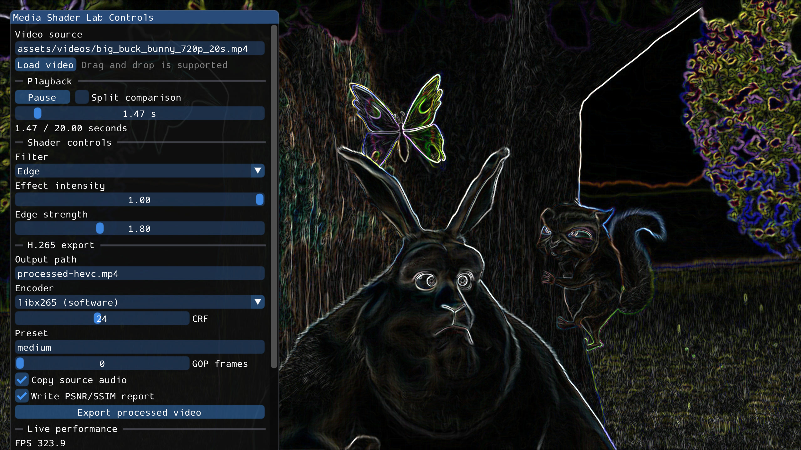
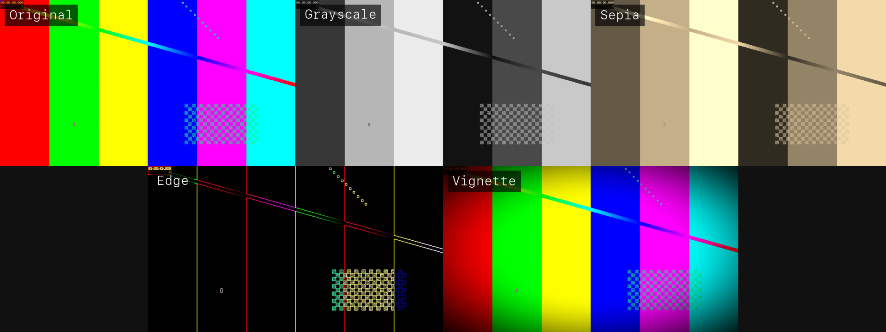
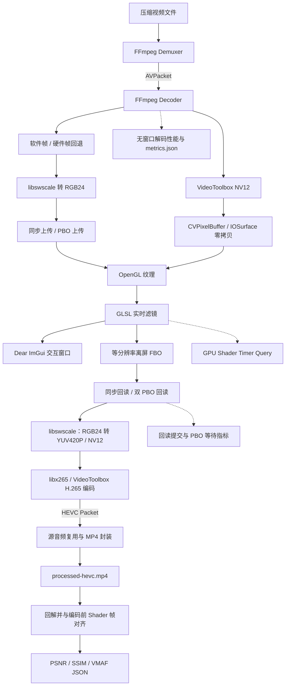
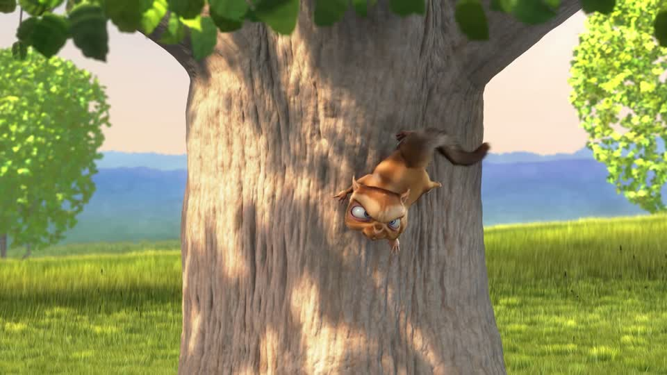

# Media Shader Lab：实时视频处理与 Shader 实验平台

[](https://github.com/NoireOffical/media-shader-lab/actions/workflows/ci.yml)

简体中文 | [English](README.md)

Media Shader Lab 是一个使用 C++17、FFmpeg、OpenGL、GLSL 和 Dear ImGui 实现的端到端视频处理项目。项目完成压缩视频解封装与解码、GPU Shader 实时处理、离屏帧缓冲回读、H.265 软硬件编码、源音频复用、MP4 封装和编码后画质评估，适合作为音视频、图形渲染及媒体基础架构方向的作品集项目。

当前 0.3 版本没有使用上层播放器框架封装媒体链路，而是保留了从压缩码流、GPU 处理到重新编码输出的完整数据路径，便于理解、调试和性能分析。

## 项目目标

- 建立一条可运行、可观察的 FFmpeg 视频解码链路；
- 将视频帧上传至 GPU，通过 GLSL 实现实时画面处理；
- 采集解码、渲染和端到端处理性能，为后续优化提供依据；
- 建立“解码—GPU 处理—H.265 编码—画质验证”的完整闭环。

## 核心功能

- 使用 FFmpeg 完成视频解封装与解码；
- 支持 FFmpeg 软件解码与 macOS VideoToolbox 硬件解码动态切换；
- 对 VideoToolbox 输出的 NV12 `CVPixelBuffer` 做引用计数托管，将 IOSurface 双平面直接绑定为 OpenGL 纹理，并在 GLSL 中完成 YUV→RGB；
- 对不支持的硬件像素格式或非 IOSurface 帧自动回退到 CPU 转换，也可用 `--no-zero-copy` 强制运行回拷基线；
- 正确处理 packet/frame 背压、`EAGAIN` 和解码器 flush；
- 使用 `libswscale` 将解码帧转换为 RGB24；
- 使用 OpenGL 完成纹理创建、视频帧上传和全屏渲染；
- 使用 GLSL Fragment Shader 提供原始、灰度、复古、边缘检测和动态暗角效果；
- 提供 Dear ImGui 可视化控制台，支持路径加载和视频文件拖拽；
- 支持播放/暂停、进度拖动和关键帧 seek；
- 支持滤镜选择、效果强度、边缘强度和暗角强度实时调节；
- 支持原图/处理结果分屏对比；
- 实时展示 FPS、平均解码/渲染耗时、P95 延迟和延迟曲线；
- 支持运行时快捷键切换滤镜与控制播放；
- 支持无窗口模式下的纯解码性能测试；
- 支持将 FPS、平均耗时和 P95 延迟导出为 JSON；
- 使用独立离屏帧缓冲按源视频分辨率读取 Shader 输出；
- 使用双 PBO 对纹理上传和帧缓冲回读进行流水化，并正确 flush 最后一帧；
- 使用 OpenGL Timer Query 测量 Shader 的真实 GPU 时间，并拆分上传、回读提交和 PBO 等待；
- 使用 `libswscale` 将 RGB24 转换为 YUV420P/NV12；
- 支持 `libx265` 软件编码和 macOS VideoToolbox 硬件 H.265 编码；
- 正确处理编码器背压、延迟帧 flush、PTS/time_base 和 MP4 trailer；
- 支持将源 AAC 等兼容音频流无损复用到最终 MP4，并按输出时长裁剪；
- 支持 CRF、preset、目标码率、GOP、音频复制和导出取消；
- 对 H.265 输出进行回解，并以编码前 Shader 结果为基准计算 PSNR、8×8 亮度 SSIM 和 VMAF；
- 提供指标单测、关键帧 seek 测试和 H.265 编码—回解集成测试。
- 提供可复现基准工具，自动生成包含设备、提交号、素材 SHA-256 和逐次运行数据的 JSON/CSV；
- 通过 GitHub Actions 在 Linux/macOS 构建测试，并运行 ASan、UBSan 与 CodeQL。

## 可视化效果

### 8 秒真实管线演示

[](https://github.com/NoireOffical/media-shader-lab/releases/download/v0.3.0/media-shader-lab-demo.mp4)

演示先展示程序真实的 Dear ImGui 控制台，再动态对比 `original`、`grayscale`、`edge` 与 `vignette` 四路输出。每个处理画面都实际经过仓库中的 FFmpeg 解码、OpenGL/GLSL 渲染和 H.265 导出路径；后期只负责四宫格排版和面向 GitHub 的 H.264 封装。点击动图可查看 Release 附带的高清版本。

交互控制台直接叠加在视频渲染窗口上：



下图由程序创建隐藏 OpenGL 上下文，从实际帧缓冲读取五种 Shader 的输出后合成，并非后期模拟效果：



## 技术架构



视频处理流程分为四层：

1. **媒体层**：负责解封装、解码、RGB/YUV 转换、H.265 编码、音频复用和 MP4 封装；
2. **渲染层**：负责 OpenGL 上下文、纹理上传、Shader 执行、离屏处理和画面显示；
3. **交互层**：负责播放、seek、Shader 参数、编码参数、导出进度和取消；
4. **观测层**：负责解码/渲染/编码性能以及 PSNR、SSIM、VMAF 画质报告。

## 项目结构

```text
media-shader-lab/
├── CMakeLists.txt
├── Makefile
├── include/medialab/
│   ├── VideoDecoder.hpp       # FFmpeg 解码接口
│   ├── VideoEncoder.hpp       # H.265 编码与 MP4 输出接口
│   ├── GLRenderer.hpp         # OpenGL 显示与离屏处理接口
│   ├── Metrics.hpp            # 性能指标接口
│   └── QualityMetrics.hpp     # PSNR/SSIM/VMAF 画质接口
├── src/
│   ├── main.cpp               # 命令行入口与处理主循环
│   ├── media/VideoDecoder.cpp # 解封装、解码与 RGB 转换
│   ├── media/VideoEncoder.cpp # RGB/YUV、HEVC 编码、音频复用与 MP4 封装
│   ├── render/GLRenderer.cpp  # 纹理上传、Shader 渲染与帧缓冲回读
│   └── core/                  # 性能及画质指标与 JSON 输出
├── shaders/
│   ├── video.vert
│   └── video.frag
├── third_party/imgui/          # Dear ImGui 1.92.8 与官方后端
├── tests/
│   ├── MetricsTest.cpp
│   ├── QualityMetricsTest.cpp
│   ├── VideoDecoderIntegrationTest.cpp
│   └── VideoEncoderIntegrationTest.cpp
└── scripts/
    ├── build_ffmpeg_with_vmaf.sh # 固定版本的 libvmaf/FFmpeg 构建脚本
    ├── check_dependencies.sh
    └── benchmark_pipeline.py     # 可复现软/硬解、零拷贝与 PBO 对照
```

## 环境要求

- macOS；
- 支持 C++17 的 Apple Clang 或 LLVM Clang；
- CMake 3.20 及以上版本；
- FFmpeg 开发库；
- GLFW；
- pkg-config；
- macOS 系统 OpenGL Framework。

安装依赖：

```bash
brew install cmake pkg-config ffmpeg glfw
```

如果没有 Homebrew 或不希望使用管理员权限，推荐用 micromamba 在项目内创建隔离环境：

```bash
micromamba create --yes --prefix .tools/env --file environment.yml
bash scripts/build_ffmpeg_with_vmaf.sh
```

构建脚本会从官方源码构建 libvmaf 3.2.0 和 FFmpeg 8.1.2，并显式启用 `--enable-libvmaf`、`libx264` 与 `libx265`。产物安装在 `.tools/`，不会修改系统环境，且该目录已加入 Git 忽略规则。

检查依赖是否完整：

```bash
bash scripts/check_dependencies.sh
```

如果尚未安装 FFmpeg、CMake 和 GLFW，也可以先编译不依赖第三方多媒体库的指标模块：

```bash
make test-core
```

## 编译与测试

```bash
make build
make test
```

Makefile 会优先使用 `.tools/ffmpeg-vmaf`、`.tools/vmaf` 和 `.tools/env`，避免误连到系统中未启用 libvmaf 的 FFmpeg。

如果使用 Homebrew 安装依赖，可将上面命令中的 `.tools/env/bin/` 前缀去掉，并省略三个工具路径参数。

编译完成后，可执行文件位于：

```text
build/media_shader_lab
```

## 快速开始

项目已经包含一段来自 Blender 基金会开放电影 Big Buck Bunny 的 20 秒测试片：

```text
assets/videos/big_buck_bunny_720p_20s.mp4
```

该片段为 720p、30 FPS、H.264/AAC，共 600 帧，来源与 CC BY 3.0 署名信息见[测试素材说明](assets/videos/README.md)。画面包含草地、树木、角色毛发、快速运动和明暗变化，适合观察各种 Shader 效果。



如果暂时没有测试视频，可以用 FFmpeg 生成一段 8 秒、720p、30 FPS 的 H.264 视频：

```bash
ffmpeg -f lavfi \
  -i testsrc2=size=1280x720:rate=30 \
  -t 8 \
  -c:v libx264 \
  sample.mp4
```

启动实时渲染窗口：

```bash
./build/media_shader_lab \
  --input assets/videos/big_buck_bunny_720p_20s.mp4 \
  --filter edge
```

启动后可以在控制台中输入新路径或把视频直接拖入窗口，通过按钮暂停/播放、拖动进度条、切换滤镜和调整 Shader 参数。

运行过程中可以使用以下快捷键：

- `0`：原始画面；
- `1`：灰度滤镜；
- `2`：复古滤镜；
- `3`：边缘检测；
- `4`：动态暗角；
- `Space`：播放/暂停；
- `Esc`：退出程序。

## 无窗口性能测试

无窗口模式不会创建 OpenGL 窗口，适合测试纯解码吞吐量：

```bash
./build/media_shader_lab \
  --input sample.mp4 \
  --headless \
  --no-sync \
  --max-frames 240 \
  --metrics-output metrics.json
```

主要参数如下：

| 参数 | 说明 |
| --- | --- |
| `--input PATH` | 输入视频路径，必填 |
| `--filter NAME` | 初始滤镜，可选 `original`、`grayscale`、`sepia`、`edge`、`vignette` |
| `--decoder NAME` | `software` 软件解码或 `videotoolbox` 硬件解码 |
| `--headless` | 不创建窗口，仅执行解码与指标统计 |
| `--max-frames N` | 最多处理 N 帧，0 表示处理到视频结束 |
| `--no-sync` | 不根据 PTS 等待，以最快速度处理视频 |
| `--no-pbo` | 关闭异步 PBO，使用同步上传/回读基线 |
| `--no-zero-copy` | 强制 VideoToolbox 帧回拷到 CPU，用于兼容与 A/B 对照 |
| `--metrics-output PATH` | 将最终统计结果写入 JSON 文件 |
| `--snapshot PATH` | 隐藏窗口渲染一帧并输出为 PPM 图片 |
| `--ui-snapshot PATH` | 隐藏窗口渲染一帧，并在图片中包含控制台 |
| `--snapshot-frame N` | 在第 N 帧抓图，便于记录已经产生的实时指标曲线 |
| `--output PATH` | 将 Shader 处理结果编码为 H.265/MP4 |
| `--encoder NAME` | `libx265` 软件编码或 `hevc_videotoolbox` 硬件编码 |
| `--crf N` | libx265 质量参数，范围 0–51，默认 24 |
| `--preset NAME` | libx265 速度/压缩率预设，默认 `medium` |
| `--bitrate-kbps N` | 硬件编码目标码率，默认 6000 kbps |
| `--gop N` | 关键帧间隔，0 表示自动使用约 2 秒 |
| `--no-audio` | 不复制源音频，仅输出视频流 |
| `--quality-output PATH` | 回解编码结果并输出 PSNR/SSIM/VMAF JSON |
| `--shader-dir PATH` | 指定顶点与片元 Shader 所在目录 |

输出单帧 Shader 处理结果：

```bash
./build/media_shader_lab \
  --input build/sample.mp4 \
  --filter edge \
  --snapshot build/edge.ppm \
  --no-sync
```

## H.265 编码导出

使用 libx265 导出 Shader 处理结果、复制源音频并生成画质报告：

```bash
./build/media_shader_lab \
  --input assets/videos/big_buck_bunny_720p_20s.mp4 \
  --filter edge \
  --output build/edge-hevc.mp4 \
  --encoder libx265 \
  --preset medium \
  --crf 24 \
  --quality-output build/edge-hevc.quality.json \
  --no-sync
```

使用 macOS VideoToolbox 硬件编码：

```bash
./build/media_shader_lab \
  --input assets/videos/big_buck_bunny_720p_20s.mp4 \
  --filter vignette \
  --output build/vignette-videotoolbox.mp4 \
  --encoder hevc_videotoolbox \
  --bitrate-kbps 6000 \
  --quality-output build/vignette-videotoolbox.quality.json \
  --no-sync
```

导出使用与源视频相同的分辨率和帧率，分屏线及控制台不会进入输出文件。动态 Shader 使用源视频 PTS 驱动，因此编码和质量复测结果具有确定性。默认复制源音频；添加 `--no-audio` 可输出纯视频。输入输出路径必须不同，YUV420 输出要求宽高为偶数。

交互窗口中提供相同能力：填写输出路径、选择软件或硬件编码、调整 CRF/码率、选择是否复制音频及生成画质报告，然后点击 **Export processed video**。导出过程中显示进度并支持取消；取消后保留可播放的部分视频。

画质报告以“编码前的精确 Shader 帧缓冲”为参考，回解最终 HEVC 视频后逐帧计算：

- RGB24 PSNR；
- 8×8 局部亮度 SSIM；
- 基于 libvmaf 内置 `vmaf_v0.6.1` 模型的平均 VMAF；
- 实际完成对齐的帧数。

## 性能指标

当前版本输出以下指标：

- `frames`：实际处理的视频帧数；
- `elapsed_seconds`：整体运行时间；
- `wall_fps`：JSON 中按有效测试时长计算的平均 FPS；交互面板显示最近 1 秒的播放 FPS，并在暂停、seek、重新加载及导出前后重置；
- `average_decode_ms`：单帧平均解码耗时；
- `average_render_ms`：单帧平均渲染与呈现耗时；
- `p95_pipeline_ms`：解码与渲染总耗时的 P95；
- `max_pipeline_ms`：单帧处理链路的最大耗时。

编码导出额外输出：

- `encoding_fps`：包含 GPU 回读、RGB/YUV 转换、编码和封装的平均吞吐；
- `video_bytes`：编码器产生的 HEVC packet 总字节数；
- `average_psnr_db`：编码后回解帧相对编码前 Shader 帧的平均 PSNR；
- `average_ssim`：编码后回解帧的平均 8×8 亮度 SSIM；
- `average_vmaf`：编码后回解帧的平均 VMAF，并通过 `vmaf_model` 记录模型版本。

交互面板在预览阶段显示上传提交时间和 Timer Query 得到的 Shader GPU 时间。回读提交、回读 GPU Timer Query（驱动能返回非零结果时）与 PBO 映射等待只在导出/质量评估路径采样；不可用的指标显示 `N/A`，不会再把“没有样本”误报为零。VideoToolbox 对符合条件的 NV12 帧直接使用 IOSurface 双平面纹理；如像素格式或存储不兼容，则自动通过 `av_hwframe_transfer_data` 回退到系统内存。

在 Apple M5 Pro、720p/30 FPS、300 帧 Edge Shader、VideoToolbox H.265 编码条件下，本次对照结果为：PBO 开启后吞吐从 236.16 FPS 提升至 303.41 FPS（约 +28.5%），回读提交从 1.019 ms 降至 0.030 ms；输出帧数、码量及 PSNR/SSIM/VMAF 与同步路径保持一致。该数字仅代表当前设备和测试素材。

正式发布性能数据时，应同时注明：测试设备、操作系统、视频分辨率、帧率、编码格式、码率、输入时长和构建模式，保证结果可以复现。

## 可复现基准测试

Release 构建完成后执行：

```bash
python3 scripts/benchmark_pipeline.py
```

默认使用仓库内同一段 720p/30 FPS 素材，各运行 300 帧、重复 3 次并取中位数，覆盖：

- FFmpeg 软件解码；
- VideoToolbox 硬解后 CPU 回拷；
- VideoToolbox `CVPixelBuffer`/IOSurface 零拷贝；
- OpenGL 同步上传/回读；
- 双 PBO 异步上传/回读。

结果写入 `build/benchmarks/<时间>/benchmark.json` 和 `benchmark.csv`，并保留每次运行日志与导出视频。报告自动记录 Git commit、工作区是否有未提交修改、设备/系统、输入 SHA-256、帧数、滤镜、编码器和完整命令。可用 `--frames 60 --repeats 1` 快速冒烟验证，用 `--decode-only` 只测解码，用 `--quality` 同时生成 PSNR/SSIM/VMAF 报告。

## 持续集成

每次推送及 Pull Request 都会在 Linux、macOS 上执行 Release 构建和单元/集成测试；Linux 另有 ASan/UBSan 内存与未定义行为检查，编译链路同时接入 CodeQL。Dependabot 每周检查 GitHub Actions 版本。

## 技术亮点

1. **完整媒体链路**：直接使用 FFmpeg 底层接口处理解码/编码背压、frame/packet、时间戳、延迟帧排空、音频复用和 MP4 trailer，而非只调用转码命令；
2. **媒体与渲染解耦**：解码帧通过稳定的数据结构交给渲染模块，便于替换 OpenGL、Vulkan或无窗口处理后端；
3. **可观测性建设**：从第一版开始采集平均值、P95 和最大延迟，避免只关注“能否运行”；
4. **可扩展 Shader 管线**：滤镜逻辑保存在独立 GLSL 文件中，便于继续增加色彩变换、卷积、模糊和材质效果；
5. **软硬编码双路径**：统一封装 libx265 和 VideoToolbox，支持 CRF/码率/GOP、音频复制、进度和取消；
6. **工具化交互能力**：使用 Dear ImGui 将播放、seek、滤镜、编码导出和性能曲线组合为统一工作台；
7. **可验证性**：通过 H.265 编码—MP4 封装—回解测试验证帧数、时长和 flush，并用 PSNR/SSIM/VMAF 验证压缩质量。
8. **可量化优化**：通过 PBO 开关和 OpenGL Timer Query 对同步/异步传输做同源 A/B 测试，区分 CPU 提交、GPU Shader 与同步等待。
9. **硬解零拷贝**：对 `CVPixelBuffer` 做安全生命周期托管，将 NV12 IOSurface 双平面直接绑定到 GPU，并保留可观测、可强制切换的 CPU 回退路径。
10. **工程可复现性**：同一脚本固化测试矩阵、输入校验值和设备环境，CI 覆盖双平台、Sanitizer 与静态安全扫描。

## 后续路线

1. 在 Timer Query 基础上增加 CPU/GPU 利用率、功耗和显存占用；
2. 接入 ONNX Runtime，实现可选的人像分割、超分辨率或风格化处理；
3. 将渲染后端迁移至 Vulkan，并使用现有基准工具发布后端性能对比。

## 简历表述建议

完成 MVP 并取得可复现的测试数据后，可以写为：

> 基于 C++17、FFmpeg 与 OpenGL/GLSL 打通“软/硬件解码—GPU 处理—H.265 编码—MP4 封装—画质评估”完整链路，将 VideoToolbox NV12 `CVPixelBuffer`/IOSurface 双平面直接映射为 GPU 纹理并设计 CPU 回退，实现双 PBO 异步传输与 Timer Query 分阶段分析；固化同源 A/B 基准并接入 Linux/macOS CI、ASan/UBSan 和 CodeQL。

简历中的性能数字应来自真实测试，避免在没有注明设备、分辨率、编码格式和测试样本的情况下填写估算结果。

## 当前状态

- [x] FFmpeg 解封装与软件解码代码；
- [x] RGB24 像素格式转换；
- [x] OpenGL 纹理上传与窗口显示；
- [x] 五种 GLSL 显示模式；
- [x] Dear ImGui 可视化控制台；
- [x] 路径加载与视频文件拖拽；
- [x] 播放/暂停、进度条与关键帧 seek；
- [x] Shader 参数滑块与原图/结果分屏；
- [x] FPS、平均耗时、P95 和实时延迟曲线；
- [x] 无窗口解码测试和 JSON 指标；
- [x] 指标模块单元测试；
- [x] 完整依赖环境下的编译与无窗口解码验证；
- [x] 等分辨率 Shader 离屏处理与 RGB 帧缓冲回读；
- [x] libx265 H.265 编码与 MP4 封装；
- [x] VideoToolbox 硬件 H.265 编码；
- [x] VideoToolbox H.264/H.265 硬件解码与软件解码切换；
- [x] VideoToolbox `CVPixelBuffer`/IOSurface NV12 双平面零拷贝渲染与 CPU 回退；
- [x] PBO 双缓冲异步上传/回读与尾帧 flush；
- [x] OpenGL Timer Query 和传输等待分阶段指标；
- [x] 源音频复用、时长裁剪和取消导出；
- [x] PSNR、8×8 亮度 SSIM 和 VMAF 画质评估；
- [x] H.265 编码、flush、时长和回解集成测试；
- [x] 可复现软/硬解、零拷贝和 PBO 对照基准（JSON/CSV）；
- [x] Linux/macOS CI、ASan/UBSan 与 CodeQL；
- [ ] AI 视频处理模块。

## 许可证

本项目使用 MIT License。Dear ImGui 1.92.8 同样采用 MIT License，详情见 [第三方依赖声明](THIRD_PARTY_NOTICES.md)。
